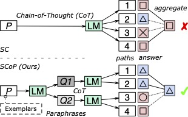

# Paraphrase and Solve: Exploring and Exploiting the Impact of Surface Form on Mathematical Reasoning in Large Language Models




The repository contains the code of the paper:
> **Paraphrase and Solve: Exploring and Exploiting the Impact of Surface Form on Mathematical Reasoning in Large Language Models (NAACL'2024)** 
> [[Paper]](https://aclanthology.org/2024.naacl-long.153/) [[OpenReview]](https://openreview.net/forum?id=lnPP2TO3jW7) <br>
> Yue Zhou, Yada Zhu, Diego Antognini, Yoon Kim, and Yang Zhang <br>

> [!NOTE]
> The repository is currently being edited.

## Requirement
## Run
Example of solving a dataset
```shell
python3 explore.py --data_fp data/sample.txt --SCN 4 --K 2 --outfp 'res.txt'
```
Example of obtaining exemplars for in-context paraphrasing
```shell
python3 get_exemplars.py --data_fp res.txt --theta 0.1 --max_N 1 --outfp 'exemplars.txt'
```

## Cite
```bibtex
@inproceedings{zhou-etal-2024-paraphrase,
    title = "Paraphrase and Solve: Exploring and Exploiting the Impact of Surface Form on Mathematical Reasoning in Large Language Models",
    author = "Zhou, Yue  and
      Zhu, Yada  and
      Antognini, Diego  and
      Kim, Yoon  and
      Zhang, Yang",
    editor = "Duh, Kevin  and
      Gomez, Helena  and
      Bethard, Steven",
    booktitle = "Proceedings of the 2024 Conference of the North American Chapter of the Association for Computational Linguistics: Human Language Technologies (Volume 1: Long Papers)",
    month = jun,
    year = "2024",
    address = "Mexico City, Mexico",
    publisher = "Association for Computational Linguistics",
    url = "https://aclanthology.org/2024.naacl-long.153",
    doi = "10.18653/v1/2024.naacl-long.153",
    pages = "2793--2804",
    abstract = "This paper studies the relationship between the surface form of a mathematical problem and its solvability by large language models. We find that subtle alterations in the surface form can significantly impact the answer distribution and the solve rate, exposing the language model{'}s lack of robustness and sensitivity to the surface form in reasoning through complex problems. To improve mathematical reasoning performance, we propose Self-Consistency-over-Paraphrases (SCoP), which diversifies reasoning paths from specific surface forms of the problem. We evaluate our approach on four mathematics reasoning benchmarks over three large language models and show that SCoP improves mathematical reasoning performance over vanilla self-consistency, particularly for problems initially deemed unsolvable. Finally, we provide additional experiments and discussion regarding problem difficulty and surface forms, including cross-model difficulty agreement and paraphrasing transferability, and Variance of Variations (VOV) for language model evaluation.",
}
```

