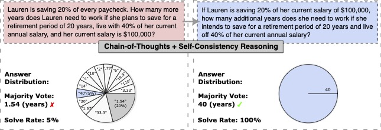

# Paraphrase and Solve: Exploring and Exploiting the Impact of Surface Form on Mathematical Reasoning in Large Language Models (In Editing)

The repository contains the code of the paper:
> **Paraphrase and Solve: Exploring and Exploiting the Impact of Surface Form on Mathematical Reasoning in Large Language Models (NAACL'2024)** 
> [[Paper]](https://aclanthology.org/2024.naacl-main) [[OpenReview]](https://openreview.net/forum?id=lnPP2TO3jW7)  
> Yue Zhou, Yada Zhu, Diego Antognini, Yoon Kim, and Yang Zhang  

## Run

## Cite
